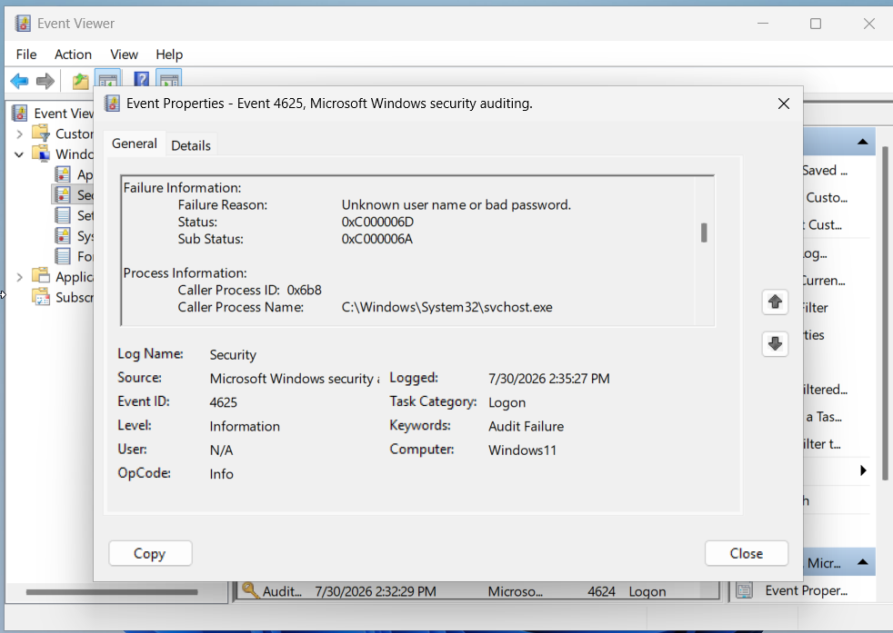
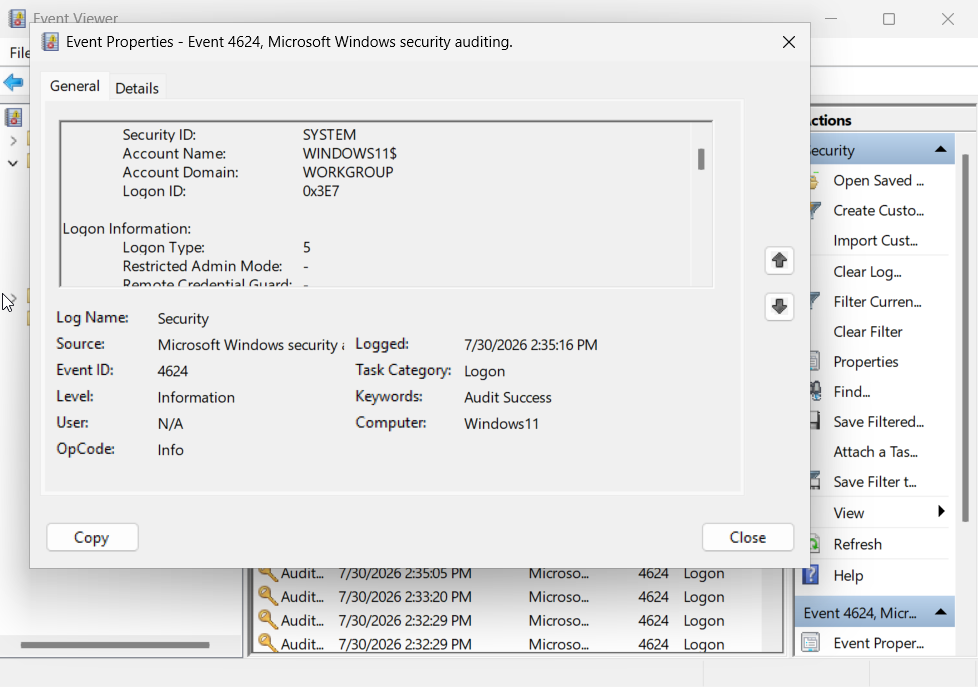
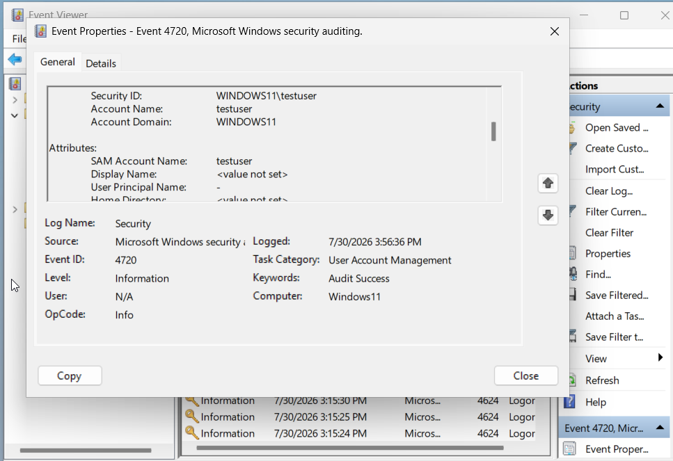

# Phase 2: Local Event Log Analysis & Attack Simulations

## Overview
Phase 2 executes controlled authentication failures, local account creation, and explicit credential delegation to inspect raw Windows Security logs and establish baseline diagnostic field indicators.


---


## Tools & Technologies
* **Log Viewer Utilities:** Windows Event Viewer (`eventvwr.msc`), PowerShell `Get-WinEvent`
* **Target Event IDs:** Event ID 4624 (Successful Logon), Event ID 4625 (Failed Logon), Event ID 4720 (User Account Created), Event ID 4648 (Explicit Credentials Used)
* **Administrative CLI:** `net user`, `runas`


## Technical Implementation & Security Exercises

### 1. Brute-Force Password Simulation
Signed out of the VM session and intentionally submitted 5 incorrect passwords within 14 seconds before entering the correct password.

### 2. Account Creation & Credential Delegation Tests
Created a local test user via administrative PowerShell and executed explicit credential delegation:

```powershell
# Create local test account
net user testuser Password123 /add

# Execute explicit credential delegation
runas /user:WINDOWS11\testuser cmd
```

## Engineering & Troubleshooting
### Technical Insight 1: Noise Isolation in Event ID 4624 Logs
#### Observation: 
Multiple Event ID 4624 (Successful Logon) entries appeared between failed password attempts.
#### Analysis: 
Event properties revealed these events belonged to account SYSTEM with Logon Type 5 (Service logon started automatically by background processes).
#### Takeaway: 
Genuine human interactive logons produce Logon Type 2. Analysts must filter by Logon Type and Account Name to differentiate human activity from background noise.

### Technical Insight 2: Sub Status Diagnostic Codes
#### Analysis: 
Event ID 4625 logs contained Failure Reason Unknown user name or bad password alongside Status 0xC000006D and Sub Status 0xC000006A.
#### Takeaway: 
Sub Status 0xC000006A specifies a valid username with an incorrect password (password spraying/targeted brute force). 
Sub Status 0xC0000064 indicates an invalid username (reconnaissance).

## Phase Results & Verification
Event Viewer captured the failed login attempt, recording Caller Process svchost.exe and Sub Status 0xC000006A.


Cross-checking Event ID 4624 logs confirmed Logon Type 2 for interactive human sessions versus Logon Type 5 for SYSTEM background services.


Executing net user testuser Password123 /add generated Event ID 4720 under User Account Management.


## Next Steps
Proceed to Phase 3: Multi-Layer Network & Forwarder Pipeline to stream these logs into Splunk Enterprise.


