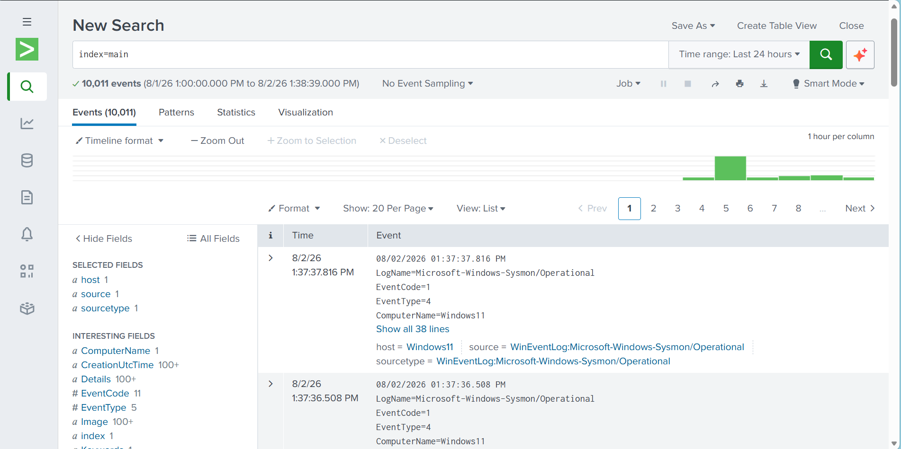
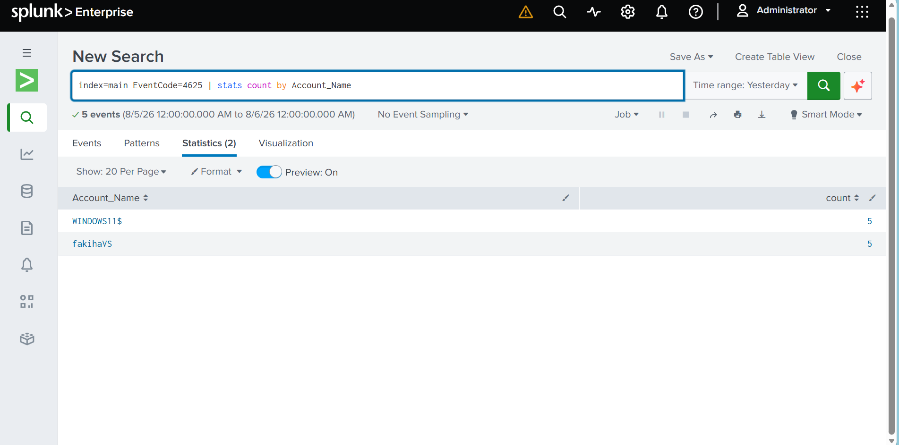
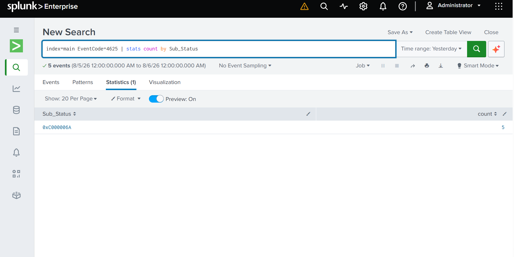
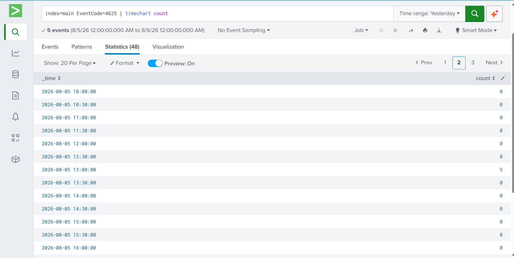
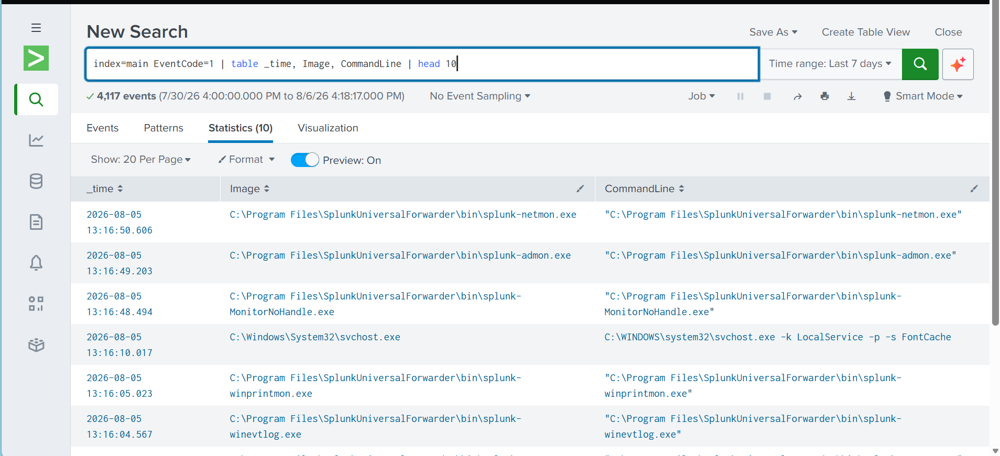

# Phase 3: Multi-Layer Network & Forwarder Pipeline

## Overview & Purpose
Phase 3 establishes host-to-guest networking, deploys the Splunk Universal Forwarder, resolves four system-level ingestion barriers, and analyzes logs in Splunk using Splunk Processing Language (SPL).


---


## Tools & Technologies
* **SIEM Platform:** Splunk Enterprise 10.4.2 (Host Laptop, Web Port `8000`)
* **Log Forwarding Agent:** Splunk Universal Forwarder (Guest VM)
* **Networking Controls:** VirtualBox Bridged Adapter, Windows Defender Firewall
* **Configuration File:** `inputs.conf`
* **Analytics Engine:** Splunk Processing Language (SPL)

---

## Technical Implementation
### 1. Network Layer & VirtualBox Provisioning
To enable direct communication between the guest endpoint VM and the host SIEM instance, the guest network adapter was switched from NAT to **Bridged Networking** mode in VirtualBox. This assigned the guest VM an IP address on the host's local subnet (`192.168.1.x`), establishing bidirectional routing over TCP/IP.

### 2. Splunk Universal Forwarder Installation
1. Downloaded and executed the Splunk Universal Forwarder installer (`splunkforwarder-*.msi`) inside the guest VM.
2. Specified the host IP address (`192.168.1.x`) and Receiver Port (`9997`) during initial configuration.
3. Completed the setup wizard to create the background service (`SplunkForwarder`).

### 3. Ingestion Pipeline Configuration
Configured `inputs.conf` inside `C:\Program Files\SplunkUniversalForwarder\etc\system\local\`:

```ini
[WinEventLog:Security]
disabled = 0
index = main

[WinEventLog:Microsoft-Windows-Sysmon/Operational]
disabled = 0
index = main
```

### 4. Service Restart & Ingestion Pipeline Initialization
Applied configuration changes by restarting the forwarder daemon via PowerShell:

```powershell
cd "C:\Program Files\SplunkUniversalForwarder\bin"
.\splunk.exe restart
```

### SPL Query Construction & Verification
Once ingestion was active, structured searches were executed in Splunk Web to analyze incoming telemetry

#### Search 1: Basic Failed Logon Filter
Filtered search results for Windows Event Code 4625 in Splunk

```spl
index="main" EventCode=4625
```

#### Search 2: Stats Count by Targeted Account 
Statistical aggregation table grouping failed logins by account name.

```spl
index=main EventCode=4625
| stats count by Account_Name
```

#### Search 3: Sub Status Breakdown 
Sub Status distribution breakdown identifying authentication failure reasons.

```spl
index=main EventCode=4625
| stats count by Sub_Status
```

#### Search 4: Timechart Burst Analysis 
Timechart visualization illustrating burst patterns during authentication failures.

```spl
index=main EventCode=4625
| timechart count
```

#### Search 5: Interactive vs. Failed Table 
Formatted table displaying Event ID 4624 and 4625 events chronologically.

```spl
index=main (EventCode=4624 OR EventCode=4625)
| table _time, EventCode, Account_Name
```

#### Search 6: Sysmon Process Creation 
Table displaying recent process creation events (Sysmon Event ID 1).

```spl
index=main EventCode=1
| table _time, Image | head 10
```

## Engineering & Troubleshooting
### Issue 1: Host-to-Guest Ping Timeout under Bridged Networking
Pinging the host IP from the guest VM timed out.
#### Root Cause: 
Host Windows Defender Firewall blocked ICMPv4 echo requests by default.
#### Resolution: 
I checked active network adapters using ipconfig on both host and guest to confirm they were on the same subnet (192.168.1.x). I then inspected host firewall rules, identified that File and Printer Sharing (Echo Request - ICMPv4-In) was disabled, and enabled it to restore host ICMP responses.

### Issue 2: Missing Shared Folder Path
Shared folder path could not be accessed inside the VM to copy installer files.
#### Resolution: 
Installed VirtualBox Guest Additions inside the guest OS to enable shared folder mounting. 

### Issue 3: Syntax Typo & Inactive Channel Formatting in inputs.conf
Security logs were not appearing in Splunk Web despite the forwarder running.
#### Root Cause: 
inputs.conf contained a typo ([WinEventLog:Secuirty]) and used string parameter disabled = false.
#### Resolution: 
I inspected C:\Program Files\SplunkUniversalForwarder\etc\system\local\inputs.conf, spotted the spelling error, and when it still didn't work, did some research and replaced string boolean values with strict integer flags (disabled = 0).

### Issue 4: Inbound Port 9997 Firewall Blockade
splunkd.log logged TcpOutEloop - Cooked connection to ip=192.168.1.x:9997 timed out.
#### Resolution: 
I pinged the host from the guest VM. When connection failed, I added an Inbound Firewall Rule on the host permitting TCP 9997 across Domain, Private, and Public network profiles.

### Issue 5: Sysmon Operational Log Access Denied (errorCode=5)
splunkd.log logged Event Log channel 'Microsoft-Windows-Sysmon/Operational': errorCode=5.
#### Root Cause: 
The SplunkForwarder service ran under restricted account NT SERVICE\SplunkForwarder which lacked read rights to Sysmon logs.
#### Resolution: 
I researched errorCode=5 (Windows ERROR_ACCESS_DENIED), opened services.msc, located the SplunkForwarder service properties, updated the Log On context to Local System, and restarted the service. This granted administrative rights over protected log channels.

## Phase Results & Verification
Searching index=main in Splunk Web confirmed real-time log ingestion


Shows aggregating failure events by account name


Shows categorizing failure events by sub status


Visualizes threat metrics over time


Sysmon process telemetry being ingested


## Next Steps
Proceed to Phase 4: Python REST API Polling & HTML Report Automation to automate report generation using Python.
