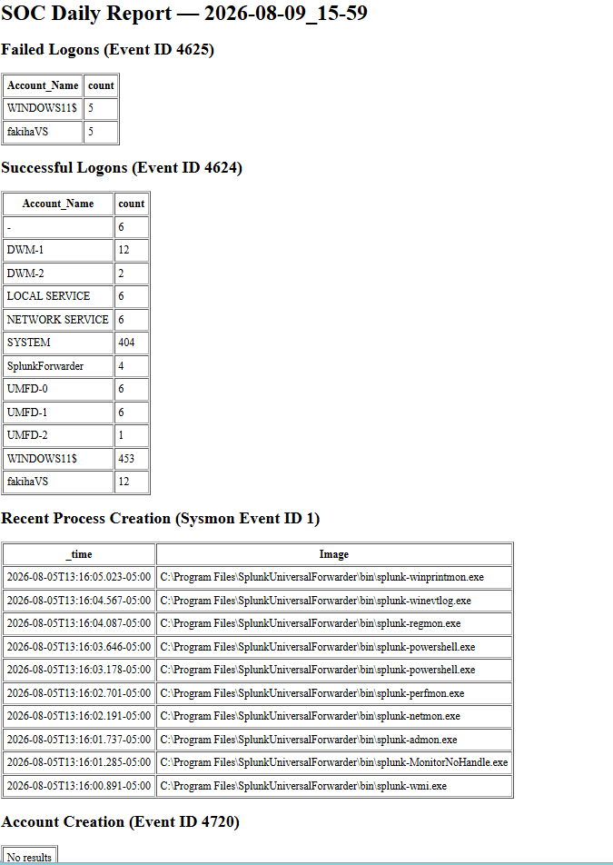

# Phase 4: Python REST API Polling & HTML Report Automation

## Overview & Purpose
Phase 4 replaces manual SIEM searches with programmatic SOC daily reporting by developing a Python script that interacts with Splunk's REST API to execute searches, poll job execution state, and export styled HTML reports.


---


## Tools & Technologies
* **API Interface:** Splunk REST API (Management Port `8089`)
* **Programming Environment:** Python 3.x, Administrative PowerShell
* **Credential Protection:** Bearer Token Authentication, Environment Variable Storage (`SPLUNK_TOKEN`)
* **Script Location:** `scripts/soc_report_generator.py`


## Technical Implementation

### 1. Token Generation & Secret Storage
Generated a 90-day API token in Splunk Web and stored it as an environment variable in PowerShell to keep credentials out of code files:

```powershell
setx SPLUNK_TOKEN "pasted-token-value-here"
```
### 2. API Test Script (splunk_test.py)
Tested authentication against Splunk REST API management port 8089:

```python
import os
import requests

SPLUNK_HOST = "https://localhost:8089"
TOKEN = os.environ.get("SPLUNK_TOKEN")
headers = {"Authorization": f"Bearer {TOKEN}"}

response = requests.get(f"{SPLUNK_HOST}/services/server/info", headers=headers, verify=False)
print("Status code:", response.status_code)
```

### 3. Developed and Ran Script
Created [SOC Report Generator](../scripts/soc_report_generator.py) script to generate reports from live SIEM data in a single command

* Script is structured around a configurable list of report sections making it easy to modify queries for different event types
* **run_search():** handles submission and polling for any query
* **generate_html_report():** compiles all sections into one timestamped file

## Engineering & Troubleshooting
### Technical Insight 1: Asynchronous Search Execution & Polling Loops
#### Observation:
Submitting a POST request to /services/search/jobs returns HTTP status 201 Created and an XML payload containing a Search ID (sid), but does not return immediate search results.
#### Resolution: 
Built a Python polling loop using xml.etree.ElementTree to parse the sid, repeatedly checking /services/search/jobs/{sid}?output_mode=json with 1-second pauses (time.sleep(1)) until field isDone evaluates to True.

### Technical Insight 2: SSL Certificate Suppression in Dev Environments
#### Observation: 
Python's requests library raises SSL validation errors when connecting to Splunk's management port 8089 due to local self-signed certificates.
#### Resolution: 
Applied verify=False to HTTP requests and suppressed warnings using urllib3.disable_warnings() due to working in a dev environment

## Phase Results & Verification
### API Authentication Success
Querying /services/server/info returned HTTP status 200, confirming Bearer Token authentication.

### Search ID (sid) Generation
Submitting a search POST request successfully returned Search ID 1786300103.647.

### Status Polling Loop Execution
The polling loop tracked search execution until isDone returned True, triggering result fetching.

### Automated HTML Report Generation
Executing python scripts/soc_report_generator.py compiled search results into a timestamped HTML daily SOC summary report (soc_report_YYYY-MM-DD_HH-MM.html).



## Next Step
Check out [SOC Report Generator](../scripts/soc_report_generator.py) script to see how it works
